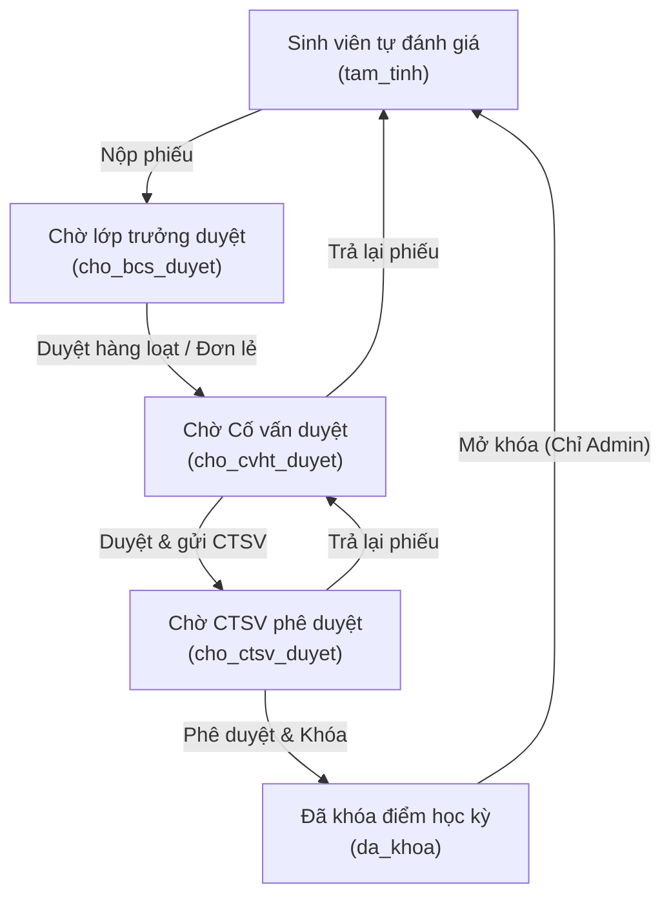
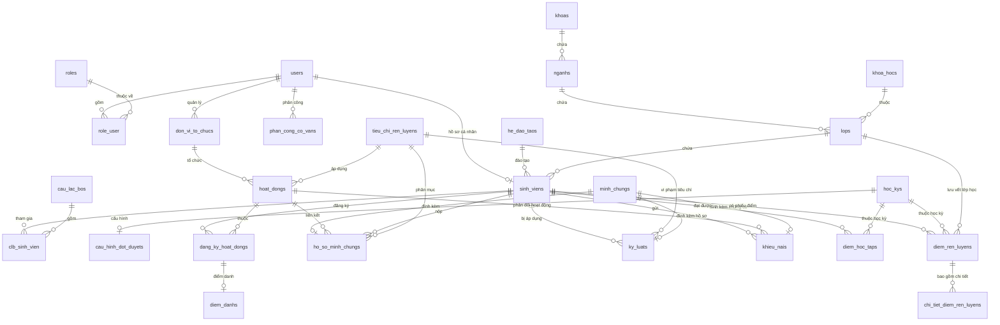

# 📋 BÁO CÁO TỔNG QUAN HỆ THỐNG QUẢN LÝ ĐIỂM RÈN LUYỆN SINH VIÊN (SV-DRL)

---

## I. MÔ TẢ BÀI TOÁN & GIẢI PHÁP

### 1. Thực trạng & Bài toán đặt ra
Trong môi trường giáo dục đại học, điểm rèn luyện là tiêu chí quan trọng để đánh giá ý thức công dân, tinh thần học tập và sự tích cực tham gia hoạt động xã hội của sinh viên. Điểm rèn luyện trực tiếp ảnh hưởng đến việc xét học bổng, xét tốt nghiệp và đánh giá xếp loại cuối năm. Tuy nhiên, quy trình quản lý điểm rèn luyện truyền thống hiện nay gặp nhiều khó khăn:
- **Thủ công & Tốn thời gian**: Sinh viên tự chấm trên giấy hoặc file Excel rời rạc, Ban cán sự lớp và Cố vấn học tập (CVHT) phải thu nhận, tổng hợp thủ công vô cùng vất vả.
- **Dễ sai sót & Thất lạc minh chứng**: Minh chứng (giấy khen, chứng chỉ, ảnh chụp hoạt động) được nộp rời rạc qua email, Zalo dễ bị thất lạc hoặc khó xác thực.
- **Không cập nhật thời gian thực**: Quy trình chấm điểm và duyệt điểm diễn ra chậm chạp, sinh viên khó theo dõi trạng thái hồ sơ của mình trong thời gian thực.
- **Khó khăn trong điểm danh hoạt động**: Việc điểm danh sinh viên tham gia các hoạt động ngoại khóa bằng giấy dễ dẫn đến tình trạng gian lận điểm danh hộ.

### 2. Giải pháp hệ thống (SV-DRL)
Hệ thống **SV-DRL** ra đời như một giải pháp số hóa toàn diện quy trình tự đánh giá và quản lý điểm rèn luyện:
- **Đánh giá đa chiều trực tuyến**: Hỗ trợ quy trình đánh giá 5 bước khép kín từ Sinh viên tự chấm → Ban cán sự rà soát → Cố vấn học tập chấm điểm → Phòng CTSV phê duyệt và khóa điểm.
- **Số hóa minh chứng**: Sinh viên tải ảnh/PDF minh chứng trực tiếp lên hệ thống, gắn với từng tiêu chí cụ thể để CVHT phê duyệt trực tuyến.
- **Điểm danh QR Code thời gian thực (Real-time)**: Áp dụng công nghệ điểm danh QR động tự động đóng/mở theo thời gian thực để ngăn chặn việc điểm danh hộ và cập nhật điểm rèn luyện ngay lập tức khi quét thành công.
- **Phúc khảo trực tuyến**: Hỗ trợ luồng khiếu nại giúp giải quyết thắc mắc điểm số giữa Sinh viên và Ban cán sự/CVHT một cách minh bạch.

---

## II. ĐỐI TƯỢNG SỬ DỤNG (USER PERSONAS & ROLES)

Hệ thống được thiết kế phân quyền chặt chẽ thành 5 vai trò nghiệp vụ rõ ràng:

1. **Sinh Viên (Student)**:
   - Tự khai báo, chấm điểm rèn luyện theo bộ tiêu chí chi tiết cho từng học kỳ.
   - Tải lên minh chứng số và gửi yêu cầu phê duyệt.
   - Đăng ký tham gia hoạt động ngoại khóa và thực hiện điểm danh quét mã QR.
   - Theo dõi tiến độ duyệt và gửi khiếu nại phúc khảo khi có thắc mắc điểm số.

2. **Ban Cán Sự Lớp (Class Monitor - BCS)**:
   - Thừa hưởng đầy đủ quyền hạn của Sinh viên.
   - Theo dõi tiến độ tự đánh giá điểm rèn luyện của toàn bộ thành viên lớp chủ nhiệm.
   - Sử dụng tính năng **Bulk Approve (Duyệt hàng loạt)** để chuyển nhanh trạng thái điểm lớp lên cấp Cố vấn học tập phê duyệt.

3. **Cố Vấn Học Tập (CVHT)**:
   - Quản lý các lớp được phân công chủ nhiệm theo từng học kỳ.
   - Kiểm tra tính hợp lệ của các hồ sơ minh chứng mà sinh viên nộp lên (Phê duyệt/Từ chối).
   - Điều chỉnh điểm rèn luyện chi tiết của từng sinh viên dựa trên thực tế chấp hành kỷ luật và hoạt động của lớp.
   - Phản hồi lý do điều chỉnh và chốt bảng điểm của lớp chuyển lên Phòng CTSV.

4. **Phòng Công Tác Sinh Viên (CTSV)**:
   - Quản lý các đợt đánh giá theo Học kỳ, cấu hình mốc thời gian của từng giai đoạn duyệt.
   - Duyệt hồ sơ tổng thể cấp Khoa/Trường, xuất báo cáo thống kê CSV dữ liệu điểm.
   - Tạo mới hoạt động rèn luyện trong trường, cấu hình mã QR điểm danh tự động đóng/mở.
   - Phê duyệt quyết định điểm cuối cùng và tiến hành khóa điểm học kỳ (Không cho phép chỉnh sửa thêm).

5. **Quản Trị Viên Hệ Thống (Admin)**:
   - Cấu hình hệ thống, quản lý danh mục nền tảng (Khoa, Ngành, Lớp, Hệ đào tạo, Học kỳ).
   - Quản trị tài khoản người dùng, phân quyền vai trò.
   - Phân công Cố vấn học tập quản lý các lớp học.
   - Cấu hình bộ tiêu chí đánh giá cốt lõi và giới hạn điểm tối đa của từng tiêu chí.

---

## III. LUỒNG NGHIỆP VỤ CHÍNH (SYSTEM WORKFLOWS)

### 1. Luồng duyệt Phiếu điểm Rèn luyện 5 bước


### 2. Luồng điểm danh hoạt động bằng mã QR thời gian thực
- **Phòng CTSV/Ban tổ chức** tạo hoạt động và cấu hình mã QR cố định.
- Mã QR sẽ bị làm mờ (blur bằng CSS) và khóa quét khi chưa đến giờ hoạt động.
- Khi hoạt động diễn ra, mã QR tự động mở khóa rõ nét để sinh viên quét mã.
- Sinh viên sử dụng giao diện quét QR tích hợp trên camera thiết bị của mình. Hệ thống sử dụng kết nối AJAX gửi trạng thái check-in. Khi ghi nhận thành công, màn hình giao diện sinh viên cập nhật ngay lập tức trạng thái **Đã điểm danh (co_mat)**.
- Điểm dự kiến của hoạt động tự động được tính hợp lệ vào điểm rèn luyện của sinh viên thông qua cơ chế tích lũy điểm hoạt động.

---

## IV. THIẾT KẾ CƠ SỞ DỮ LIỆU (DATABASE SCHEMA & ERD)

Dưới đây là sơ đồ quan hệ thực thể (ERD) thể hiện đầy đủ 26 bảng dữ liệu trong CSDL của hệ thống quản lý điểm rèn luyện:



---

## V. ĐIỂM NỔI BẬT & CÔNG NGHỆ HỆ THỐNG

### 1. Điểm nổi bật hệ thống (Unique Selling Points)
- **Điểm danh QR Động Real-time**: Mã QR tự động ẩn/hiện và làm mờ theo thời gian thực để chống gian lận. Quá trình điểm danh ghi nhận ngay lập tức trên UI thông qua kết nối API.
- **Bulk Approve (Phê duyệt hàng loạt)**: Tiết kiệm tối đa thời gian cho Ban cán sự lớp và Cố vấn học tập thông qua tính năng tích chọn duyệt nhanh cả lớp chỉ với 1 click.
- **Cơ chế tính điểm thông minh chống ghi đè**: Hệ thống phân tách rõ ràng giữa tự đánh giá và tính điểm từ hoạt động ngoại khóa tự động. Nếu sinh viên đã lập phiếu tự đánh giá, điểm tổng hợp được tính chính xác dựa trên từng tiêu chí thành phần đã chấm của vai trò tương ứng hiện tại, đảm bảo không bị ghi đè mất mát dữ liệu khi duyệt QR/minh chứng sau đó.
- **Ràng buộc Transaction toàn vẹn dữ liệu**: Mọi thao tác cập nhật trạng thái phiếu điểm, nộp minh chứng đều được thực thi trong một Database Transaction, đảm bảo tính nhất quán tuyệt đối.
- **Ghi dấu vết Audit Log**: Hệ thống ghi lại toàn bộ nhật ký thay đổi dữ liệu nhạy cảm (điểm số, trạng thái duyệt) giúp ngăn ngừa gian lận điểm rèn luyện.

### 2. Công nghệ sử dụng (Tech Stack)
- **Backend Framework**: Laravel 12 (PHP 8.2+) mang lại hiệu năng tối ưu, tính bảo mật cao và kiến trúc vững chắc.
- **Frontend Layer**: Template Engine Blade, kết hợp cùng Tailwind CSS cho giao diện hiện đại phong cách Glassmorphism và tối giản, cùng Alpine.js/AJAX xử lý các tác vụ bất đồng bộ mượt mà.
- **Database Engine**: SQLite mặc định cho phát triển cục bộ tiện lợi, dễ dàng mở rộng sang các hệ quản trị CSDL lớn (MySQL, PostgreSQL) thông qua cơ chế Migrations của Eloquent.

---

## VI. KHẢ NĂNG MỞ RỘNG (SCALABILITY)

Hệ thống được thiết kế với tầm nhìn dài hạn và sẵn sàng cho các nâng cấp trong tương lai:
1. **Dễ dàng chuyển đổi CSDL**: Sử dụng Eloquent ORM giúp chuyển đổi linh hoạt từ SQLite sang MySQL hoặc PostgreSQL chỉ bằng việc thay đổi cấu hình file `.env` mà không cần sửa đổi bất kỳ dòng code logic nào.
2. **Kiến trúc Tách biệt Logic (Service Layer)**: `DiemRenLuyenService` cô lập toàn bộ các phép tính toán điểm. Điều này giúp dễ dàng chuyển đổi hệ thống thành một API RESTful độc lập khi cần phát triển ứng dụng di động (Mobile App) cho sinh viên và cố vấn trong tương lai.
3. **Cấu hình Cache tối ưu**: Sẵn sàng tích hợp Redis hay Memcached để lưu trữ danh sách tiêu chí rèn luyện và bảng xếp hạng điểm, tăng tốc độ phản hồi đáng kể khi hệ thống có hàng ngàn lượt sinh viên truy cập chấm điểm cùng lúc cuối học kỳ.
4. **Tích hợp SSO (Single Sign-On)**: Cấu hình sẵn sàng tích hợp các dịch vụ xác thực tập trung của trường đại học như CAS, LDAP hoặc Google Workspace SSO cho sinh viên.

---

## VII. HƯỚNG DẪN CÀI ĐẶT & CHẠY (SETUP GUIDE)

Thực hiện các bước sau để cài đặt dự án chạy dưới localhost:

### 1. Yêu cầu môi trường
- PHP >= 8.2
- Composer (Bộ quản lý thư viện PHP)
- Node.js & PNPM (Bộ xây dựng giao diện frontend)

### 2. Cài đặt chi tiết các bước
1. **Tải mã nguồn và cài đặt dependencies**:
   ```bash
   composer install
   pnpm install
   ```

2. **Cấu hình biến môi trường**:
   - Sao chép file cấu hình:
     ```bash
     copy .env.example .env
     ```
   - Tạo khóa ứng dụng Laravel:
     ```bash
     php artisan key:generate
     ```

3. **Cấu hình Cơ sở dữ liệu SQLite**:
   - Tạo file database trống trong thư mục dự án:
     ```bash
     type NUL > database/database.sqlite
     ```
   - Kiểm tra file `.env` chắc chắn cấu hình database là SQLite:
     ```env
     DB_CONNECTION=sqlite
     ```

4. **Khởi chạy Migrations và Seeder**:
   - Tạo các bảng và nạp dữ liệu demo mẫu hoàn chỉnh:
     ```bash
     php artisan migrate:fresh --seed
     ```

5. **Khởi chạy máy chủ**:
   - Chạy dev server của Laravel:
     ```bash
     php artisan serve
     ```
   - Chạy dev server build giao diện của Vite:
     ```bash
     npm run dev
     ```
   - Truy cập trình duyệt theo địa chỉ: `http://127.0.0.1:8000`

### 3. Danh sách tài khoản thử nghiệm hệ thống
Sử dụng các tài khoản mẫu sau để đăng nhập trải nghiệm đầy đủ các tính năng tương ứng với từng phân quyền:

| Vai trò | Email đăng nhập | Mật khẩu mặc định | Ghi chú |
|---------|-----------------|-------------------|---------|
| **Quản trị viên** | `admin@sv.com` | `password` | Quản lý danh mục, người dùng, phân quyền |
| **Phòng CTSV** | `ctsv@sv.com` | `password` | Tạo hoạt động rèn luyện, duyệt chốt & khóa điểm |
| **Cố vấn học tập** | `covan@sv.com` | `password` | Quản lý lớp học được phân công, duyệt minh chứng |
| **Ban cán sự lớp** | `bcs@sv.com` | `password` | Lớp trưởng duyệt sơ bộ phiếu điểm của lớp |
| **Sinh viên** | `sinhvien@sv.com` | `password` | Sinh viên tự chấm điểm, nộp minh chứng, xem điểm |
