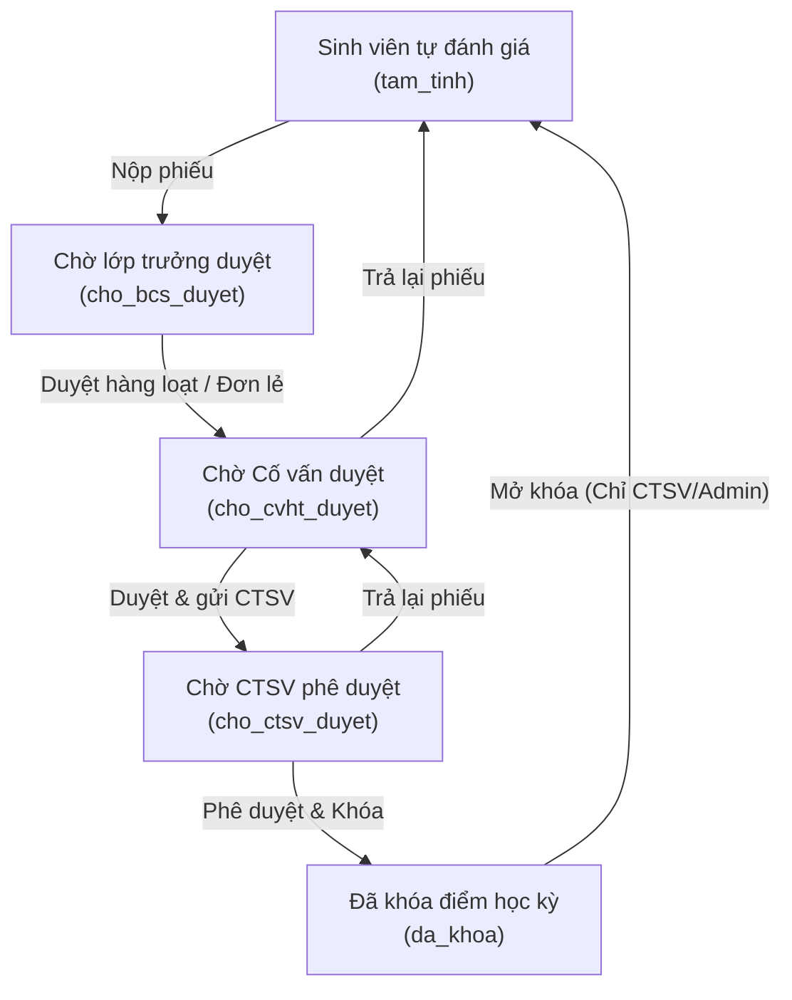
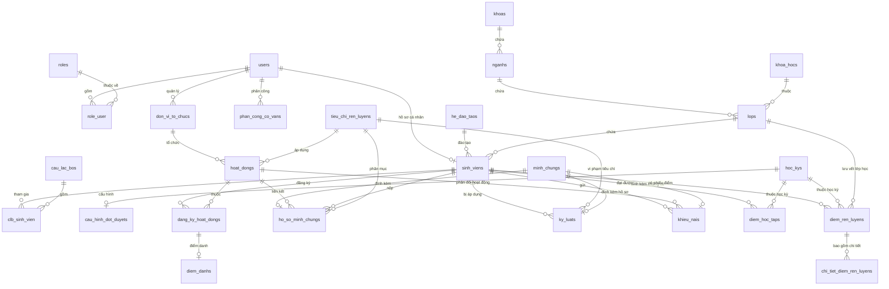

# SV-DRL - Hệ thống Quản lý Điểm rèn luyện Sinh viên

Hệ thống Quản lý Điểm rèn luyện Sinh viên (SV-DRL) được xây dựng bằng Laravel 13 và MySQL/MariaDB, phục vụ quy trình đánh giá rèn luyện trực tuyến của nhà trường một cách minh bạch, tự động và nhanh chóng. Dự án bao gồm các phân hệ chính dành cho Sinh viên, Ban Cán sự lớp, Giảng viên/Cố vấn học tập (CVHT), và phòng Công tác sinh viên (CTSV)/Khoa (đóng vai trò Quản trị hệ thống).

🔗 **Đường dẫn ứng dụng (Production Live Host)**: [https://phanmemquanlydiemrenluyen-production.up.railway.app/](https://phanmemquanlydiemrenluyen-production.up.railway.app/)

---

## 📋 MÔ TẢ BÀI TOÁN & GIẢI PHÁP HỆ THỐNG

### 1. Thực trạng & Bài toán đặt ra
Trong môi trường giáo dục đại học, điểm rèn luyện là tiêu chí quan trọng để đánh giá ý thức công dân, tinh thần học tập và sự tích cực tham gia hoạt động xã hội của sinh viên. Điểm rèn luyện trực tiếp ảnh hưởng đến việc xét học bổng, xét tốt nghiệp và đánh giá xếp loại cuối năm. Tuy nhiên, quy trình quản lý điểm rèn luyện truyền thống hiện nay gặp nhiều khó khăn:
- **Thủ công & Tốn thời gian**: Sinh viên tự chấm trên giấy hoặc file Excel rời rạc, Ban cán sự lớp và Cố vấn học tập (CVHT) phải thu nhận, tổng hợp thủ công vô cùng vất vả.
- **Dễ sai sót & Thất lạc minh chứng**: Minh chứng (giấy khen, chứng chỉ, ảnh chụp hoạt động) được nộp rời rạc qua email, Zalo dễ bị thất lạc hoặc khó xác thực.
- **Không cập nhật thời gian thực**: Quy trình chấm điểm và duyệt điểm diễn ra chậm chạp, sinh viên khó theo dõi trạng thái hồ sơ của mình trong thời gian thực.
- **Khó khăn trong điểm danh hoạt động**: Việc điểm danh sinh viên tham gia các hoạt động ngoại khóa bằng giấy dễ dẫn đến tình trạng gian lận điểm danh hộ.

### 2. Giải pháp hệ thống (SV-DRL)
Hệ thống **SV-DRL** ra đời như một giải pháp số hóa toàn diện quy trình tự đánh giá và quản lý điểm rèn luyện:
- **Đánh giá đa chiều trực tuyến**: Hỗ trợ quy trình đánh giá 5 bước khép kín từ Sinh viên tự chấm → Ban cán sự rà soát → Cố vấn học tập chấm điểm → Phòng CTSV phê duyệt và khóa điểm.
- **Số hóa minh chứng**: Sinh viên tải ảnh/PDF minh chứng trực tiếp lên hệ thống, gắn với từng tiêu chí cụ thể để CVHT phê duyệt trực tuyến.
- **Điểm danh QR Code thời gian thực (Real-time)**: Áp dụng công nghệ điểm danh QR động tự động đóng/mở theo thời gian thực để ngăn chặn việc điểm danh hộ và cập nhật điểm rèn luyện ngay lập tức khi quét thành công.
- **Phúc khảo trực tuyến**: Hỗ trợ luồng khiếu nại giúp giải quyết thắc mắc điểm số giữa Sinh viên và Ban cán sự/CVHT một cách minh bạch.

---

## 1. Tổng quan chức năng theo vai trò

Hệ thống được thiết kế phân quyền chặt chẽ thành 5 vai trò nghiệp vụ rõ ràng:

### Phân hệ Sinh viên
- **Tự chấm điểm rèn luyện cá nhân**: Thực hiện tự đánh giá và chấm điểm trực tuyến theo bộ tiêu chí gồm 5 mục chính và 1 mục vượt khung (từ TC1 đến TC6) theo cấu hình của từng học kỳ.
- **Quản lý và nộp hồ sơ minh chứng**: Tải lên hình ảnh/tập tin minh chứng (chứng chỉ, giấy khen, ảnh hoạt động) làm căn cứ đối chiếu cho các tiêu chí tương ứng hoặc lưu trữ qua liên kết Google Drive.
- **Tham gia hoạt động rèn luyện**: Theo dõi và đăng ký tham gia các hoạt động/sự kiện do nhà trường tổ chức.
- **Điểm danh thời gian thực bằng mã QR**: Điểm danh check-in tại các sự kiện thông qua mã QR động/cố định. Trạng thái tham gia tự động cập nhật thời gian thực sang `co_mat` trên giao diện mà không cần tải lại trang (no-refresh/không cần F5).
- **Theo dõi tiến độ duyệt**: Xem tiến trình phê duyệt hồ sơ điểm rèn luyện cá nhân qua các cấp (Chờ duyệt, Đã duyệt, Từ chối).
- **Gửi khiếu nại phúc khảo**: Tạo phiếu khiếu nại phản hồi trực tiếp khi có sự sai lệch về điểm rèn luyện hoặc khi minh chứng bị từ chối.

### Phân hệ Ban cán sự lớp (BCS)
- **Thừa hưởng quyền hạn của Sinh viên**: Có đầy đủ các chức năng tự đánh giá, nộp minh chứng, đăng ký hoạt động và điểm danh QR của một sinh viên thông thường.
- **Theo dõi tiến độ của lớp**: Xem danh sách thành viên lớp, kiểm tra tiến độ nộp phiếu tự đánh giá.
- **Phê duyệt nhanh hàng loạt (Bulk Approve)**: Phê duyệt nhanh hàng loạt phiếu điểm của lớp từ trạng thái `Tạm tính (tam_tinh)` sang `Chờ Cố vấn duyệt (cho_cvht_duyet)`.

### Phân hệ Giảng viên / Cố vấn học tập (CVHT)
- **Quản lý lớp chủ nhiệm**: Xem chi tiết danh sách, kết quả tự chấm điểm rèn luyện của sinh viên các lớp thuộc phân công chủ nhiệm.
- **Kiểm duyệt minh chứng**: Xem chi tiết hình ảnh, tài liệu minh chứng sinh viên nộp; thực hiện phê duyệt hoặc từ chối từng minh chứng.
- **Chấm điểm & Phản hồi**: Chỉnh sửa điểm số thực tế dựa trên minh chứng và thái độ học tập của sinh viên, đồng thời nhập ý kiến phản hồi cụ thể.
- **Chốt bảng điểm lớp**: Duyệt tổng thể phiếu điểm của cả lớp và chốt kết quả chuyển lên cấp CTSV/Khoa xét duyệt cuối cùng (`cho_ctsv_duyet`).

### Phân hệ Phòng Công tác sinh viên (CTSV) / Khoa
- **Quản lý học kỳ & Đợt đánh giá**: Tạo mới học kỳ, cấu hình mốc thời gian bắt đầu và kết thúc của từng giai đoạn duyệt.
- **Phân công cố vấn**: Phân công giảng viên phụ trách cố vấn học tập cho các lớp theo từng học kỳ.
- **Quản lý hoạt động rèn luyện**: Tạo mới hoạt động, thiết lập điểm dự kiến, số lượng slot tối đa, và tự động sinh mã QR điểm danh (có tính năng làm mờ/khóa quét QR động bằng CSS blur).
- **Duyệt hồ sơ tổng thể**: Kiểm tra chéo kết quả điểm rèn luyện và duyệt hồ sơ cấp khoa/toàn trường.
- **Thống kê & Xuất báo cáo**:
  - Xem Dashboard trực quan thống kê tỷ lệ xếp loại rèn luyện và tiến độ của từng lớp.
  - Xuất báo cáo điểm rèn luyện ra file Excel (CSV) theo mẫu của nhà trường.
- **Quản lý sao lưu (Backup & Restore)**: Thực hiện sao lưu dữ liệu thủ công hoặc tự động, tải file backup hoặc khôi phục dữ liệu hệ thống từ file SQL.

### Phân hệ Quản trị viên hệ thống (Admin)
- **Cấu hình hệ thống**: Quản lý danh mục nền tảng (Khoa, Ngành, Lớp, Hệ đào tạo, Học kỳ).
- **Quản trị tài khoản người dùng**: Quản lý các tài khoản người dùng và phân quyền vai trò.
- **Cấu hình bộ tiêu chí đánh giá**: Quản lý bộ tiêu chí đánh giá cốt lõi và giới hạn điểm tối đa của từng tiêu chí.

---

## 2. Công nghệ sử dụng

- **PHP**: Phiên bản ^8.3 (Bật các extension: `pdo`, `mbstring`, `openssl`).
- **Laravel Framework**: Phiên bản ^13.0
- **Frontend**: Blade Template Engine, Tailwind CSS v4, JavaScript, Alpine.js, jQuery, Vite.
- **Cơ sở dữ liệu**: MySQL / MariaDB (Hỗ trợ SQLite cho môi trường phát triển).
- **Sao lưu hệ thống**: Laravel Backup & Command-line SQLite/MySQL dump utilities.
- **Package Manager**: pnpm, Composer.

---

## 3. Cấu trúc dự án

```text
PhanMemQuanLyDiemRenLuyen/
|-- app/
|   |-- Http/
|   |   |-- Controllers/          # Xử lý các logic nghiệp vụ (Auth, HoatDong, DiemRenLuyen,...)
|   |   |-- Middleware/           # Middleware phân quyền (CheckRole.php) và sao lưu tự động (AutoBackupMiddleware.php)
|   |   `-- Requests/             # Validate dữ liệu đầu vào
|   |-- Models/                   # Định nghĩa các bảng CSDL bằng Eloquent ORM
|   |-- Services/                 # Logic phụ trợ như BackupService, DiemRenLuyenService
|   `-- Jobs/                     # Tác vụ nền (DatabaseBackupJob)
|-- config/                       # Cấu hình hệ thống (database, app, queue,...)
|-- database/
|   |-- migrations/               # Cấu trúc bảng CSDL
|   `-- seeders/                  # Dữ liệu mẫu (DatabaseSeeder.php)
|-- public/                       # File tĩnh, tài liệu minh chứng, database backups
|-- resources/
|   `-- views/                    # Giao diện Blade (layouts, diem_ren_luyen, hoat_dong, xet_duyet, backup,...)
|-- routes/
|   `-- web.php                   # Định nghĩa tất cả URL và Middleware áp dụng
|-- storage/                      # Chứa log hệ thống, session, cache và file uploads tạm
|-- composer.json                 # Quản lý dependencies PHP
|-- database.sql                  # Bản sao lưu/khởi tạo CSDL đầy đủ bằng tiếng Việt (Mục 2 nộp bài)
`-- package.json / pnpm-lock.yaml # Quản lý dependencies JavaScript/Vite
```

---

## 4. Yêu cầu môi trường & Khả năng tương thích Server Trường

Hệ thống được thiết kế để dễ dàng triển khai trên các hạ tầng máy chủ tiêu chuẩn của các trường Đại học/Cao đẳng. Dưới đây là thông tin chi tiết về ngôn ngữ, cơ sở dữ liệu và máy chủ web để đối chiếu với cấu hình máy chủ sẵn có của nhà trường:

### 1. Ngôn ngữ & Runtime (PHP)
- **Ngôn ngữ chính**: **PHP >= 8.3** (Xây dựng trên nền tảng framework **Laravel 13**).
- **Các PHP Extensions bắt buộc phải bật** (đã cấu hình mặc định trong hầu hết các máy chủ Web hoặc dễ dàng kích hoạt trong `php.ini`):
  - `openssl` (Bảo mật, mã hóa dữ liệu)
  - `pdo` & `pdo_mysql` (Kết nối cơ sở dữ liệu MySQL)
  - `mbstring` (Xử lý chuỗi UTF-8 tiếng Việt)
  - `xml` & `dom` (Xử lý dữ liệu XML/HTML)
  - `curl` (Hỗ trợ gọi các API bên ngoài)
  - `fileinfo` (Xác thực định dạng file minh chứng tải lên)
  - `zip` (Giải nén và nén tệp tin phục vụ backup)
  - `gd` hoặc `imagick` (Để xử lý ảnh minh chứng, sinh mã QR)
- **Quản lý thư viện**: Composer 2.x trở lên.
- **Biên dịch Frontend**: Node.js (tối thiểu v18) & pnpm / npm (chỉ cần thiết cho môi trường phát triển hoặc khi build lại assets, khi vận hành live có thể build trước và deploy thư mục `public/build` tĩnh).

### 2. Cơ sở dữ liệu (Database)
- **Hệ quản trị CSDL**: **MySQL (phiên bản 8.0 trở lên)** hoặc **MariaDB (phiên bản 10.4 trở lên)**.
- **Cơ chế lưu trữ**: Sử dụng các câu lệnh SQL tiêu chuẩn của Eloquent ORM. Do đó, hệ thống hoàn toàn tương thích và chạy ổn định trên các dịch vụ MySQL dùng chung (Shared Database) hoặc MySQL Server chuyên dụng của nhà trường.
- **Khởi tạo dữ liệu**: Hỗ trợ chạy các file migration của Laravel (`php artisan migrate`) hoặc import trực tiếp file SQL kết xuất sẵn đầy đủ dữ liệu mẫu `database.sql` đi kèm ở thư mục gốc.

### 3. Máy chủ Web (Web Server Compatibility)
Ứng dụng có thể vận hành tốt trên cả hệ điều hành **Windows Server** lẫn **Linux (Ubuntu, CentOS, RedHat, Debian...)**, tương thích tốt với các Web Server phổ biến:

- **Apache Web Server** (Khuyến nghị cho Server trường dùng cPanel / DirectAdmin / Laragon / XAMPP):
  - Hệ thống đã tích hợp sẵn tệp tin cấu hình [.htaccess](file:///e:/btap/laragon/www/PhanMemQuanLyDiemRenLuyen/public/.htaccess) trong thư mục `public/`.
  - Cần đảm bảo đã bật module `mod_rewrite` trên Apache để hỗ trợ định tuyến sạch (Pretty URLs) của Laravel.
- **Nginx Web Server** (Khuyến nghị cho Server Linux hiệu năng cao):
  - Cấu hình server block (Virtual Host) của Nginx cần chuyển hướng toàn bộ request về tệp `index.php`. Đoạn cấu hình mẫu cơ bản:
    ```nginx
    server {
        listen 80;
        server_name diemrenluyen.school.edu.vn;
        root /path/to/PhanMemQuanLyDiemRenLuyen/public;

        index index.php index.html;

        location / {
            try_files $uri $uri/ /index.php?$query_string;
        }

        location ~ \.php$ {
            include fastcgi_params;
            fastcgi_pass unix:/var/run/php/php8.3-fpm.sock; # Hoặc địa chỉ IP 127.0.0.1:9000
            fastcgi_index index.php;
            fastcgi_param SCRIPT_FILENAME $document_root$fastcgi_script_name;
        }
    }
    ```
- **IIS (Microsoft Internet Information Services)**:
  - Nếu trường sử dụng Windows Server chạy IIS, cần cài đặt module **URL Rewrite** trên IIS và cấu hình file `web.config` tương ứng trỏ vào thư mục `public/`.

> [!IMPORTANT]  
> **Lưu ý cấu hình Root Directory**: Thư mục gốc của tên miền (Document Root) trên Web Server **bắt buộc phải trỏ vào thư mục `public/`** của dự án (ví dụ: `/var/www/PhanMemQuanLyDiemRenLuyen/public`), chứ không được trỏ vào thư mục cha bên ngoài để đảm bảo tính an toàn bảo mật cho mã nguồn. Tránh lộ các file cấu hình nhạy cảm như `.env` ra ngoài internet.

---

## 5. Hướng dẫn cài đặt

1. Đặt source code vào thư mục `www` của Laragon:
   ```text
   C:\laragon\www\PhanMemQuanLyDiemRenLuyen
   ```

2. Mở Laragon và nhấn **Start All** để khởi động Apache và MySQL.

3. Mở Terminal tại thư mục dự án và chạy lệnh thiết lập tự động:
   ```bash
   composer run setup
   ```
   *Lưu ý: Lệnh này sẽ tự động chạy `composer install`, sao chép file `.env.example` thành `.env`, tạo app key, chạy migrations để tạo cấu trúc bảng, cài đặt dependencies frontend và build assets qua Vite.*

4. Chạy Seeder để nạp dữ liệu mẫu cấu hình tiêu chí và tài khoản thử nghiệm:
   ```bash
   php artisan db:seed
   ```
   *Lưu ý (Mục 2 nộp bài):* Ngoài ra, bạn có thể import trực tiếp tệp `database.sql` ở thư mục gốc vào cơ sở dữ liệu để có đầy đủ cấu trúc bảng và toàn bộ dữ liệu mẫu đã được cấu hình sẵn.

5. Chạy server phát triển (chạy đồng thời server PHP và Vite):
   ```bash
   composer run dev
   ```

6. Truy cập website qua địa chỉ mặc định: `http://localhost:8000` (hoặc domain Virtual Host của Laragon: `http://PhanMemQuanLyDiemRenLuyen.test`).

---

## 6. Tài khoản mặc định

Hệ thống sử dụng mật khẩu chung là `password` cho tất cả các tài khoản thử nghiệm sau:

| Vai trò | Email đăng nhập | Mật khẩu mặc định | Ghi chú |
|---------|-----------------|-------------------|---------|
| **Phòng CTSV (Admin)** | `ctsv@sv.com` | `password` | Quản trị hệ thống, tạo hoạt động rèn luyện, duyệt chốt & khóa điểm |
| **Cố vấn học tập (CVHT)** | `covan@sv.com` | `password` | Quản lý các lớp được phân công chủ nhiệm, duyệt minh chứng |
| **Ban cán sự lớp (BCS)** | `bcs@sv.com` | `password` | Lớp trưởng duyệt sơ bộ phiếu điểm của lớp |
| **Sinh viên** | `sinhvien@sv.com` | `password` | Sinh viên tự chấm điểm, nộp minh chứng, xem điểm |

---

## 7. Luồng nghiệp vụ & Quy trình sử dụng

### 1. Luồng duyệt Phiếu điểm Rèn luyện 5 bước


### 2. Luồng điểm danh hoạt động bằng mã QR thời gian thực
- **Phòng CTSV/Ban tổ chức** tạo hoạt động và cấu hình mã QR cố định.
- Mã QR sẽ bị làm mờ (blur bằng CSS) và khóa quét khi chưa đến giờ hoạt động.
- Khi hoạt động diễn ra, mã QR tự động mở khóa rõ nét để sinh viên quét mã.
- Sinh viên sử dụng giao diện quét QR tích hợp trên camera thiết bị của mình. Hệ thống sử dụng kết nối AJAX gửi trạng thái check-in. Khi ghi nhận thành công, màn hình giao diện sinh viên cập nhật ngay lập tức trạng thái **Đã điểm danh (co_mat)** mà không cần tải lại trang.
- Điểm dự kiến của hoạt động tự động được tính hợp lệ vào điểm rèn luyện của sinh viên thông qua cơ chế tích lũy điểm hoạt động.

### 3. Tóm tắt các bước sử dụng chính
1. **Khởi động học kỳ**: Phòng CTSV tạo học kỳ mới, thiết lập thời hạn cho 5 giai đoạn của đợt đánh giá và phân công Giảng viên làm CVHT cho các lớp hành chính.
2. **Khai báo & Điểm danh**: Sinh viên đăng ký tham gia hoạt động rèn luyện trong trường và quét mã QR tại sự kiện để điểm danh trực tiếp. Sinh viên cũng có thể nộp minh chứng hoạt động ngoài trường.
3. **Tự đánh giá**: Sinh viên vào giao diện tự đánh giá, điền điểm tự chấm cho từng mục tiêu chí (hệ thống tự động tính điểm GPA học tập quy đổi) và gửi phiếu điểm (trạng thái đổi sang `Chờ BCS lớp duyệt`).
4. **Họp lớp & BCS duyệt**: Ban cán sự lớp kiểm duyệt, rà soát tiến độ của lớp và thực hiện phê duyệt hàng loạt (Bulk Approve) để gửi phiếu điểm của lớp lên cho Cố vấn học tập (trạng thái đổi sang `Chờ Cố vấn duyệt`).
5. **Cố vấn chấm điểm**: CVHT kiểm tra các minh chứng đính kèm, thực hiện duyệt hoặc từ chối minh chứng, điều chỉnh điểm rèn luyện thực tế của sinh viên và chốt bảng điểm của lớp gửi lên trường (trạng thái đổi sang `Chờ CTSV duyệt`).
6. **CTSV thẩm định & Khóa điểm**: Phòng CTSV duyệt tổng thể toàn trường, tiếp nhận và phản hồi khiếu nại (nếu có) từ sinh viên, sau đó thực hiện chốt sổ và khóa điểm của học kỳ.

---

## 8. Các route chính

### Phân hệ chung & Xác thực
- `/login`: Đăng nhập (GET/POST)
- `/register`: Đăng ký tài khoản (GET/POST)
- `/logout`: Đăng xuất (POST)
- `/`: Dashboard hiển thị thống kê tổng quan theo vai trò (GET)

### Hoạt động rèn luyện & Điểm danh
- `/hoat-dong`: Xem danh sách hoạt động rèn luyện (GET)
- `/hoat-dong/create`: Tạo mới hoạt động - dành cho CTSV (GET/POST)
- `/hoat-dong/{id}`: Xem chi tiết hoạt động (GET)
- `/hoat-dong/{id}/dang-ky`: Đăng ký tham gia hoạt động (POST)
- `/hoat-dong/{id}/huy-dang-ky`: Hủy đăng ký hoạt động (POST)
- `/hoat-dong/{id}/diem-danh-qr`: Màn hình quét QR điểm danh của sinh viên (GET)
- `/hoat-dong/{id}/diem-danh`: Danh sách điểm danh của hoạt động - dành cho CTSV (GET)
- `/hoat-dong/diem-danh/{id}`: Lưu cập nhật trạng thái điểm danh - dành cho CTSV (POST)
- `/hoat-dong/check-attendance/{id}`: API check điểm danh thời gian thực (GET)

### Minh chứng & Khiếu nại
- `/minh-chung`: Xem danh sách và tải lên hồ sơ minh chứng (GET/POST)
- `/minh-chung/duyet/{id}`: Duyệt/từ chối minh chứng của sinh viên - dành cho CVHT/CTSV (POST)
- `/khieu-nai`: Xem và gửi khiếu nại phúc khảo điểm rèn luyện (GET/POST)
- `/khieu-nai/reply/{id}`: Phản hồi nội dung khiếu nại của sinh viên (POST)

### Xét duyệt & Bảng điểm
- `/diem-ren-luyen`: Xem bảng điểm rèn luyện cá nhân hoặc danh sách toàn trường (GET)
- `/diem-ren-luyen/tu-danh-gia`: Sinh viên tự đánh giá rèn luyện học kỳ (GET/POST)
- `/diem-ren-luyen/bao-cao`: Giao diện báo cáo, thống kê điểm rèn luyện (GET)
- `/diem-ren-luyen/bao-cao/export`: Xuất báo cáo điểm rèn luyện ra file CSV (GET)
- `/xet-duyet`: Danh sách phiếu đánh giá cần duyệt theo lớp (GET)
- `/xet-duyet/update/{id}`: Duyệt chuyển trạng thái phiếu điểm (POST)
- `/xet-duyet/{id}/danh-gia`: Xem chi tiết và đánh giá chấm điểm phiếu rèn luyện (GET/POST)
- `/xet-duyet/bulk-approve`: Phê duyệt nhanh hàng loạt phiếu điểm (POST)
- `/xet-duyet/unlock/{id}`: Mở khóa phiếu điểm rèn luyện đã chốt - dành cho CTSV (POST)

### Quản lý cấu hình & Hệ thống (Chỉ dành cho CTSV)
- `/xet-duyet/phan-cong`: Giao diện và lưu phân công cố vấn học tập lớp (GET/POST)
- `/xet-duyet/phan-cong/delete/{id}`: Xóa phân công cố vấn lớp (POST)
- `/hoc-ky/settings`: Thiết lập thời gian các giai đoạn đánh giá rèn luyện (GET/POST)
- `/backup`: Giao diện quản lý sao lưu dữ liệu (GET)
- `/backup/run`: Thực hiện sao lưu dữ liệu thủ công (POST)
- `/backup/settings`: Cấu hình tự động sao lưu dữ liệu (POST)
- `/backup/download/{file}`: Tải file sao lưu CSDL (GET)
- `/backup/delete/{file}`: Xóa bản sao lưu dữ liệu (DELETE)
- `/backup/restore/{file}`: Khôi phục CSDL từ file có sẵn trên server (POST)
- `/backup/restore-upload`: Tải file CSDL lên để khôi phục (POST)

---

## 9. Cơ sở dữ liệu

Hệ thống sử dụng cơ sở dữ liệu quan hệ gồm 26 bảng dữ liệu.

### Sơ đồ quan hệ thực thể (ERD)



### Chi tiết các bảng chính:
- `users` & `roles` & `role_user`: Quản lý thông tin tài khoản, danh mục vai trò (`ctsv`, `sinh_vien`, `ban_can_su`, `co_van`) và phân quyền.
- `he_dao_taos`, `khoas`, `nganhs`, `khoa_hocs`, `lops`: Danh mục tổ chức hành chính của nhà trường.
- `sinh_viens`: Thông tin chi tiết sinh viên liên kết với lớp và tài khoản đăng nhập.
- `cau_lac_bos` & `clb_sinh_vien`: Quản lý danh sách các câu lạc bộ và thành viên sinh hoạt.
- `don_vi_to_chucs`: Đơn vị tổ chức các hoạt động/sự kiện (ví dụ: Đoàn trường, Hội sinh viên).
- `hoc_kys` & `phan_cong_co_vans`: Quản lý học kỳ và phân công cố vấn học tập quản lý lớp theo học kỳ tương ứng.
- `cau_hinh_dot_duyets`: Lưu trữ mốc thời gian diễn ra của 5 giai đoạn chấm điểm (Tự đánh giá, BCS duyệt, CVHT duyệt, CTSV duyệt, Khiếu nại).
- `tieu_chi_ren_luyens`: Định nghĩa danh mục các tiêu chí rèn luyện và mức điểm trần tối đa.
- `hoat_dongs` & `dang_ky_hoat_dongs`: Quản lý hoạt động rèn luyện và lịch sử đăng ký tham gia của sinh viên.
- `diem_danhs`: Lưu vết thời gian check-in/check-out điểm danh của sinh viên tại các hoạt động.
- `minh_chungs` & `ho_so_minh_chungs`: Lưu trữ file minh chứng và liên kết hồ sơ đề xuất cộng điểm của sinh viên.
- `ky_luats`: Ghi nhận các trường hợp sinh viên vi phạm nội quy để tự động trừ điểm rèn luyện.
- `khieu_nais`: Ghi nhận khiếu nại, phản hồi của sinh viên và câu trả lời của các cấp xét duyệt.
- `diem_hoc_taps`: Điểm GPA học kỳ của sinh viên được nạp vào hệ thống để tự động quy đổi sang điểm rèn luyện (TC1).
- `diem_ren_luyens` & `chi_tiet_diem_ren_luyens`: Lưu kết quả tổng hợp điểm rèn luyện (xếp loại, trạng thái duyệt) và chi tiết điểm số tự chấm/duyệt của từng tiêu chí.
- `thong_baos` & `nguoi_nhan_thong_baos`: Gửi thông báo hệ thống đến người dùng.
- `audit_logs`: Nhật ký hoạt động hệ thống ghi lại lịch sử chỉnh sửa điểm, duyệt minh chứng phục vụ việc đối soát thông tin.

---

## 10. Các quy tắc nghiệp vụ & Thuật toán đặc thù

### 10.1. Quy tắc trừ điểm do vắng học (Vắng tiết lý thuyết/thực hành)
Dựa trên thống kê số tiết vắng học từ hệ thống điểm danh của phòng Đào tạo:
- Nếu tổng số tiết vắng của sinh viên trong học kỳ dưới 5 tiết (< 5 tiết): trừ 2 điểm.
- Nếu tổng số tiết vắng của sinh viên trong học kỳ trên 10 tiết (> 10 tiết): trừ 5 điểm.
*Lưu ý: Quy tắc trừ điểm này được tính dựa trên tổng số tiết vắng học tập trung của toàn bộ các học phần đăng ký, không phụ thuộc vào số lượng môn học bị vắng.*

### 10.2. Quy tắc đối với sinh viên học vượt / học lại & Điểm GPA
Để đảm bảo quyền lợi và sự linh hoạt cho lộ trình cá nhân của sinh viên:
- Với sinh viên học vượt lớp hoặc đăng ký học lại/học cải thiện, hệ thống tự động sinh thêm cột hiển thị kết quả tương thích trong bảng điểm học tập so với chương trình đào tạo chuẩn.
- Điểm trung bình học tập học kỳ (GPA) vẫn được tính toán bình thường theo tổng số tín chỉ tích lũy thực tế mà sinh viên đăng ký học trong học kỳ đó.
- Điểm GPA quy đổi (tối đa 20 điểm rèn luyện) được tự động cập nhật chính xác theo học kỳ tương ứng vào điểm tổng hợp (TC1).

---

## 11. Dự toán chi phí vận hành (Cloud Infrastructure)

Hệ thống SV-DRL được tối ưu hóa kiến trúc nhẹ, hỗ trợ triển khai trên các hạ tầng cloud phổ biến với dự toán chi phí như sau:

### 11.1. Môi trường thử nghiệm / Đánh giá (Free Tiers)
- **Hosting (Railway)**: $0/tháng (Sử dụng gói Free Starter credit).
- **Cơ sở dữ liệu (Aiven MySQL / Railway DB)**: $0/tháng (Gói MySQL miễn phí dung lượng dưới 1GB).
- **Lưu trữ minh chứng (Supabase Storage / Cloudflare R2)**: $0/tháng (Miễn phí 10GB lưu trữ).
- **Email gửi thông báo (Brevo)**: $0/tháng (Giới hạn gửi tối đa 300 emails/ngày).
- **Tên miền (Domain)**: $0/tháng (Sử dụng subdomain mặc định `.up.railway.app`).
* **Tổng chi phí thử nghiệm**: $0/tháng.

### 11.2. Môi trường vận hành thực tế (Production Scale - 5,000 - 10,000 sinh viên)
- **Hosting (Railway Pro / VPS)**: $5 - $10/tháng (Đảm bảo container hoạt động 24/7, không bị ngủ đông).
- **Cơ sở dữ liệu (Railway DB / Aiven Basic)**: $10 - $15/tháng (Tăng bộ nhớ RAM, dung lượng và hỗ trợ tự động sao lưu dữ liệu).
- **Lưu trữ minh chứng (Cloudflare R2)**: $3 - $5/tháng (Chi phí lưu trữ ảnh minh chứng cực rẻ, không mất phí băng thông).
- **Dịch vụ gửi Mail (Brevo / Mailgun)**: $5 - $10/tháng (Hỗ trợ gửi email báo điểm/nhắc nhở với số lượng lớn).
- **Tên miền riêng (.edu.vn / .com)**: ~$10/năm (khoảng $0.8/tháng).
* **Tổng chi phí vận hành thực tế ước tính**: $23.8 - $40.8/tháng (tương đương khoảng 600,000đ - 1,000,000đ/tháng).

---

## 12. Cấu hình tự động sao lưu dữ liệu

Hệ thống tích hợp chức năng sao lưu dữ liệu tự động định kỳ nhằm đảm bảo an toàn thông tin:
- **Cơ chế hoạt động**: Sử dụng `AutoBackupMiddleware` để kiểm tra thời gian sao lưu tiếp theo khi có người dùng truy cập. Khi đến hạn, hệ thống sẽ tự động kích hoạt tiến trình chạy ngầm qua queue (`DatabaseBackupJob`) giúp người dùng không cảm thấy độ trễ.
- **Cấu hình hàng ngày/hàng tuần**: CTSV có thể thay đổi tần suất sao lưu (hàng ngày, hàng tuần, hàng tháng) và thời gian sao lưu mong muốn ngay trên giao diện `/backup`.
- **Hàng đợi (Queue)**: Để đảm bảo việc sao lưu không gây nghẽn hệ thống, các bản sao lưu được đẩy vào queue. Do đó, cần khởi chạy hàng đợi bằng lệnh:
  ```bash
  php artisan queue:listen
  ```
  (Hoặc chạy qua lệnh gộp `composer run dev`).

---

## 13. Điểm nổi bật & Khả năng mở rộng

### Điểm nổi bật (Unique Selling Points)
- **Điểm danh QR Code thời gian thực không cần tải lại trang**: Tích hợp cơ chế realtime. Khi sinh viên quét mã QR thành công, giao diện hoạt động tự động cập nhật trạng thái đã điểm danh sang `co_mat` ngay lập tức mà không cần F5 trình duyệt.
- **Tính năng khóa/mở khóa QR động**: Mã QR điểm danh được bảo mật bằng hiệu ứng làm mờ (blur bằng CSS) tự động trước thời gian diễn ra sự kiện và chỉ hiển thị rõ nét khi đến giờ điểm danh.
- **Xét duyệt đa cấp chặt chẽ**: Quy trình 4 bước khép kín (Sinh viên -> Ban cán sự -> Cố vấn -> CTSV) phản ánh đúng nghiệp vụ thực tế của các trường Đại học.
- **Phê duyệt hàng loạt tiện lợi (Bulk Approve)**: Cho phép BCS lớp và CVHT duyệt nhanh toàn bộ danh sách sinh viên chỉ với 1 click chuột, tiết kiệm tối đa thời gian.
- **Cơ chế tính điểm thông minh chống ghi đè**: Hệ thống phân tách rõ ràng giữa tự đánh giá và tính điểm từ hoạt động ngoại khóa tự động. Nếu sinh viên đã lập phiếu tự đánh giá, điểm tổng hợp được tính chính xác dựa trên từng tiêu chí thành phần đã chấm của vai trò tương ứng hiện tại, đảm bảo không bị ghi đè mất mát dữ liệu khi duyệt QR/minh chứng sau đó.
- **Ràng buộc Transaction toàn vẹn dữ liệu**: Mọi thao tác cập nhật trạng thái phiếu điểm, nộp minh chứng đều được thực thi trong một Database Transaction, đảm bảo tính nhất quán tuyệt đối.
- **Ghi dấu vết Audit Log**: Hệ thống ghi lại toàn bộ nhật ký thay đổi dữ liệu nhạy cảm (điểm số, trạng thái duyệt) giúp ngăn ngừa gian lận điểm rèn luyện.
- **Hệ thống Backup & Restore toàn diện**: Tích hợp công cụ quản lý sao lưu trực tiếp trên Web Admin, cho phép CTSV khôi phục nhanh hệ thống từ các bản sao lưu cũ hoặc upload file SQL mới.

### Khả năng mở rộng (Scalability)
- **Dễ dàng chuyển đổi CSDL**: Sử dụng Eloquent ORM giúp chuyển đổi linh hoạt từ SQLite sang MySQL hoặc PostgreSQL chỉ bằng việc thay đổi cấu hình file `.env` mà không cần sửa đổi bất kỳ dòng code logic nào.
- **Kiến trúc Tách biệt Logic (Service Layer)**: `DiemRenLuyenService` cô lập toàn bộ các phép tính toán điểm. Điều này giúp dễ dàng chuyển đổi hệ thống thành một API RESTful độc lập khi cần phát triển ứng dụng di động (Mobile App) cho sinh viên và cố vấn trong tương lai.
- **Cấu hình Cache tối ưu**: Sẵn sàng tích hợp Redis hay Memcached để lưu trữ danh sách tiêu chí rèn luyện và bảng xếp hạng điểm, tăng tốc độ phản hồi đáng kể khi hệ thống có hàng ngàn lượt sinh viên truy cập chấm điểm cùng lúc cuối học kỳ.
- **Tích hợp SSO (Single Sign-On)**: Cấu hình sẵn sàng tích hợp các dịch vụ xác thực tập trung của trường đại học như CAS, LDAP hoặc Google Workspace SSO cho sinh viên.
- **Tích hợp API Google Drive/OneDrive**: Mở rộng dung lượng lưu trữ minh chứng bằng cách đồng bộ trực tiếp lên đám mây thay vì lưu trữ cục bộ trên máy chủ.
- **Hệ thống Điểm danh nhận diện khuôn mặt (FaceID) hoặc GPS**: Tích hợp các công nghệ xác thực vị trí và nhận diện sinh viên để phòng chống tình trạng điểm danh hộ qua QR Code.
- **Tự động đồng bộ điểm GPA từ Cổng thông tin đào tạo**: Xây dựng Webhook/API kết nối trực tiếp với phân hệ Quản lý đào tạo để nạp điểm GPA của sinh viên thay vì nhập tay/import file excel.

---

## 14. Lưu ý khi chấm hoặc demo

- **Học kỳ hiện tại**: Hệ thống kiểm tra thời gian thực để mở/khóa các nút chấm điểm rèn luyện dựa trên cấu hình các giai đoạn của đợt xét duyệt (`cau_hinh_dot_duyets`). Khi demo, nếu thấy nút tự chấm hoặc nút duyệt bị ẩn, hãy truy cập tài khoản CTSV (`ctsv@sv.com`) -> Vào **Cấu hình học kỳ** để nới rộng thời gian của giai đoạn tương ứng hoặc nhấn **Mở khóa chỉnh sửa** cho sinh viên đó.
- **Chạy Queue**: Cần chạy queue lắng nghe tác vụ (`php artisan queue:listen`) để xử lý các yêu cầu sao lưu ngầm hoặc chạy đồng thời bằng `composer run dev`.
- **Thư mục Upload & Backup**: Đảm bảo các thư mục `storage/app/backups`, `storage/app/public/minh_chung` và các thư mục tương tự có quyền ghi (chạy `php artisan storage:link` để tạo liên kết public).

---

## 15. Gợi ý kiểm thử nhanh

1. Đăng nhập bằng tài khoản **Sinh viên** (`sinhvien@sv.com`): Đăng ký một hoạt động, xem giao diện tự đánh giá rèn luyện học kỳ và tải lên file minh chứng.
2. Đăng nhập tài khoản **Ban cán sự** (`bcs@sv.com`): Vào trang quản lý lớp chủ nhiệm để xem tiến độ tự chấm của sinh viên, sau đó thực hiện duyệt hàng loạt lớp.
3. Đăng nhập tài khoản **Cố vấn học tập** (`covan@sv.com`): Kiểm duyệt hồ sơ minh chứng đã nộp, điều chỉnh điểm rèn luyện thực tế của sinh viên, điền lý do/phản hồi và chốt điểm của lớp.
4. Đăng nhập tài khoản **CTSV** (`ctsv@sv.com`):
   - Tạo một hoạt động rèn luyện mới, mở mã QR điểm danh.
   - Thử chức năng sao lưu dữ liệu thủ công, tải xuống bản backup và thử khôi phục lại hệ thống.
   - Xem dashboard thống kê biểu đồ và xuất báo cáo Excel điểm rèn luyện.

---

## 16. Tác giả

- Họ và tên: Thanh Thiên
- Tài khoản: ThanhThien07
- Email: slen010207@gmail.com

---

## 17. Ghi chú

README này được cấu trúc lại hoàn chỉnh theo đúng nghiệp vụ thực tế của Phần mềm Quản lý Điểm rèn luyện Sinh viên (SV-DRL) đang chạy trong mã nguồn.
