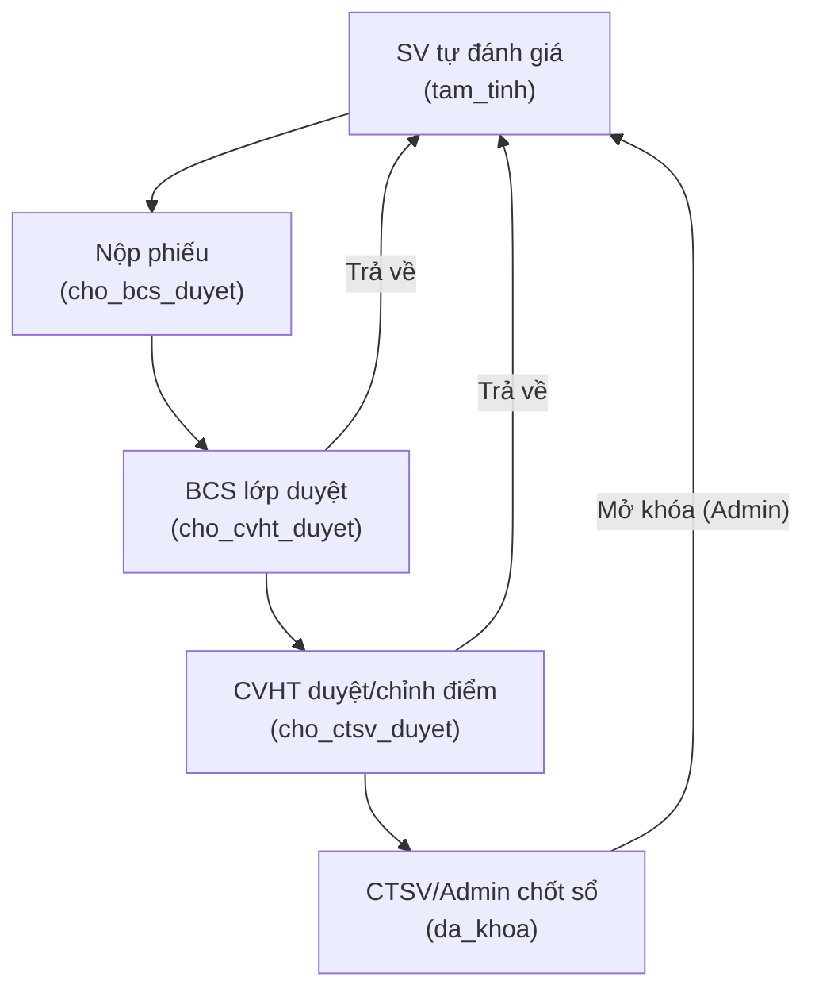

# 📊 So sánh Project với Yêu cầu Giám khảo

## Yêu cầu Giám khảo (Trích từ ảnh "V. CẤU TRÚC VÒNG THI VÀ HỒ SƠ DỰ THI")

Giai đoạn **"Trước Vòng Demo sản phẩm"** yêu cầu nộp:

| # | Yêu cầu | Trạng thái | Ghi chú |
|---|---------|:----------:|---------|
| 1 | **Source code** | ✅ Có | Dự án Laravel 12 đầy đủ |
| 2 | **Cơ sở dữ liệu** | ✅ Có | 8 file migration + DatabaseSeeder đầy đủ demo data |
| 3 | **Tài khoản demo** | ✅ Có | 4 tài khoản trong Seeder (xem bên dưới) |
| 4 | **Video demo** | ❌ **CHƯA CÓ** | Không tìm thấy file video demo nào trong project |
| 5 | **File báo cáo tổng quan hệ thống** | ✅ **ĐÃ CÓ** | File `Báo cáo tổng hợp.md` đầy đủ nội dung chi tiết |
| 6 | **Khuyến khích triển khai host** | ✅ **ĐÃ CÓ** | 🔗 [https://phanmemquanlydiemrenluyen-production.up.railway.app/](https://phanmemquanlydiemrenluyen-production.up.railway.app/) — Đang hoạt động! |

---

## Phân tích chi tiết File báo cáo tổng quan

Theo yêu cầu giám khảo, file báo cáo tổng quan **PHẢI gồm**:

| # | Nội dung yêu cầu | Trạng thái | Nhận xét |
|---|-------------------|:----------:|----------|
| 1 | **Mô tả bài toán** | ✅ **ĐÃ CÓ** | Chi tiết trong `Báo cáo tổng hợp.md` |
| 2 | **Đối tượng sử dụng** | ✅ **ĐÃ CÓ** | Chi tiết trong `Báo cáo tổng hợp.md` |
| 3 | **Danh sách chức năng/luồng nghiệp vụ** | ✅ **ĐÃ CÓ** | Chi tiết trong `Báo cáo tổng hợp.md` |
| 4 | **Thiết kế dữ liệu** | ✅ **ĐÃ CÓ** | Sơ đồ CSDL/ERD chi tiết dạng Mermaid |
| 5 | **Điểm nổi bật** | ✅ **ĐÃ CÓ** | Chi tiết trong `Báo cáo tổng hợp.md` |
| 6 | **Khả năng mở rộng** | ✅ **ĐÃ CÓ** | Chi tiết trong `Báo cáo tổng hợp.md` |
| 7 | **Công nghệ sử dụng** | ✅ **ĐÃ CÓ** | Chi tiết trong `Báo cáo tổng hợp.md` |
| 8 | **Hướng dẫn chạy** | ✅ **ĐÃ CÓ** | Hướng dẫn cài đặt Setup Guide chi tiết |

---

## Đánh giá chi tiết Source Code

### ✅ Kiến trúc & Công nghệ
- **Framework**: Laravel 12 (PHP) + Blade + Vite
- **Database**: SQLite (mặc định), hỗ trợ MySQL
- **Kiến trúc MVC**: Chuẩn Laravel, phân chia rõ ràng
- **Service Layer**: Có `DiemRenLuyenService` tách business logic
- **Helper**: Có `EvaluationCriteria` cấu hình bộ tiêu chí 6 mục (I-VI)

### ✅ Hệ thống phân quyền (5 vai trò)

| Vai trò | Email demo | Mật khẩu | Chức năng chính |
|---------|-----------|----------|-----------------|
| **Admin/CTSV** | `ctsv@sv.com` | `password` | Quản lý toàn bộ hệ thống, tạo hoạt động, cấu hình học kỳ, chốt điểm |
| **Sinh viên** | `sinhvien@sv.com` | `password` | Tự đánh giá, nộp minh chứng, đăng ký hoạt động, điểm danh QR |
| **Ban cán sự** | `bcs@sv.com` | `password` | Quyền SV + duyệt sơ bộ phiếu điểm lớp |
| **Cố vấn HT** | `covan@sv.com` | `password` | Duyệt minh chứng, chỉnh điểm, chốt bảng điểm lớp |

### ✅ Các chức năng đã implement (theo README)

#### 1. Sinh viên
- [x] Tự chấm điểm rèn luyện (6 mục I-VI, 30+ tiêu chí con)
- [x] Nộp minh chứng trực tuyến (JPG, PNG, PDF, max 5MB)
- [x] Đăng ký tham gia hoạt động rèn luyện
- [x] Điểm danh QR thời gian thực
- [x] Theo dõi trạng thái duyệt (tam_tinh → cho_bcs_duyet → cho_cvht_duyet → cho_ctsv_duyet → da_khoa)
- [x] Gửi khiếu nại/phúc khảo

#### 2. Ban cán sự lớp
- [x] Thừa hưởng quyền sinh viên
- [x] Theo dõi tiến độ lớp
- [x] Phê duyệt hàng loạt (Bulk Approve)

#### 3. Cố vấn học tập
- [x] Quản lý danh sách lớp được phân công
- [x] Duyệt minh chứng
- [x] Điều chỉnh điểm & phản hồi
- [x] Chốt bảng điểm lớp

#### 4. Admin/CTSV
- [x] Quản lý đợt đánh giá (Học kỳ)
- [x] Duyệt hồ sơ tổng thể
- [x] Quản lý hoạt động & QR
- [x] Thống kê & Xuất báo cáo CSV
- [x] Chốt sổ & khóa điểm
- [x] Phân công Cố vấn học tập
- [x] Cấu hình tỉ lệ điểm (80/20 mặc định)

#### 5. Tính năng kỹ thuật nổi bật
- [x] QR code tự động sinh + blur/unlock theo thời gian
- [x] Database Transaction (đảm bảo toàn vẹn dữ liệu)
- [x] Audit Log (ghi lịch sử thay đổi)
- [x] Bulk Approve (duyệt hàng loạt)
- [x] Service Layer (tách business logic)
- [x] Seeder đầy đủ dữ liệu demo
- [x] Middleware phân quyền theo role

### ✅ Database Schema (26 bảng)

```
users, he_dao_taos, khoas, nganhs, khoa_hocs, lops,
roles, role_user, sinh_viens, cau_lac_bos, clb_sinh_vien,
don_vi_to_chucs, hoc_kys, cau_hinh_dot_duyets,
tieu_chi_ren_luyens, hoat_dongs, dang_ky_hoat_dongs,
diem_danhs, minh_chungs, ho_so_minh_chungs, ky_luats,
khieu_nais, diem_hoc_taps, diem_ren_luyens, thong_baos,
nguoi_nhan_thong_baos, audit_logs,
chi_tiet_diem_ren_luyens, phan_cong_co_vans
```

### ✅ Luồng nghiệp vụ chính



---

## ❌ Những thứ CÒN THIẾU so với yêu cầu giám khảo

### 1. Video Demo (BẮT BUỘC)
> **Yêu cầu**: "Nộp sản phẩm hoàn chỉnh gồm: ... video demo"

Cần quay video demo đầy đủ các luồng chính:
- Đăng nhập → Dashboard từng vai trò
- SV tự đánh giá → nộp phiếu
- BCS duyệt → CVHT duyệt → CTSV chốt
- QR điểm danh
- Nộp minh chứng → duyệt
- Xuất báo cáo CSV
- Khiếu nại/phúc khảo

---

## 📋 Tóm tắt & Khuyến nghị hành động

| Hạng mục | Trạng thái | Hành động cần làm |
|----------|:----------:|-------------------|
| Source code | ✅ Tốt | Không cần thay đổi lớn |
| CSDL & Demo data | ✅ Tốt | Seeder đầy đủ 5 vai trò |
| Tài khoản demo | ✅ Tốt | 5 tài khoản sẵn sàng |
| **Video demo** | ❌ Thiếu | **Cần quay video demo ngay** |
| **Báo cáo tổng quan** | ✅ Đầy đủ | Đã tạo file `Báo cáo tổng hợp.md` |
| **ERD / Sơ đồ CSDL** | ✅ Đầy đủ | Sơ đồ Mermaid ERD chi tiết |
| **Hướng dẫn cài đặt** | ✅ Đầy đủ | Hướng dẫn Setup Guide chi tiết |
| Slide thuyết trình | ❓ Chưa rõ | Cần cho vòng Demo sản phẩm |

> [!IMPORTANT]
> **Ưu tiên hàng đầu**: Quay **video demo** thực tế các tính năng chính của hệ thống. Các nội dung báo cáo tổng hợp, sơ đồ thực thể ERD, phân tách role Admin/CTSV và tài liệu hướng dẫn chạy đều đã được hoàn thiện đầy đủ.

> [!TIP]
> Source code nhìn chung **khá chất lượng**: có Service Layer, Transaction, Audit Log, phân quyền chặt chẽ, bộ tiêu chí 5 mục 30+ tiêu chí con theo chuẩn thực tế. Điểm mạnh nhất là hệ thống phân quyền 5 cấp và luồng duyệt đa tầng.

